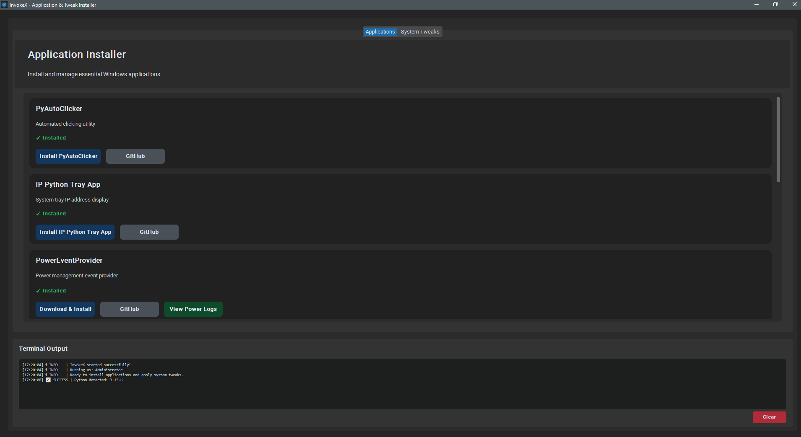
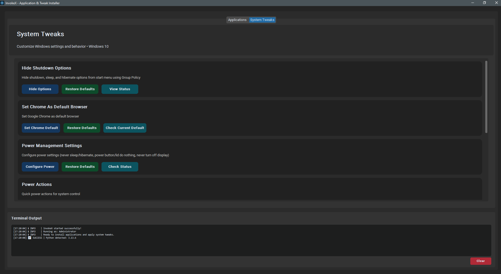
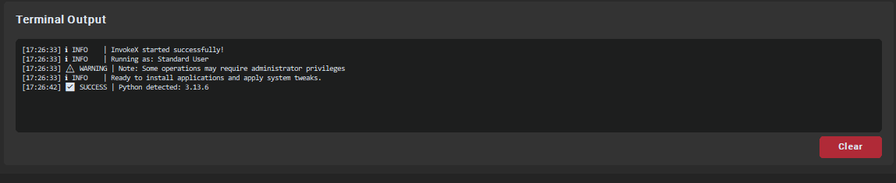

# InvokeX - Modern Windows Application & Tweak Installer

<div align="center">


**A modern, user-friendly GUI application for installing essential Windows applications and applying system tweaks**

[](https://python.org)
[](https://microsoft.com/windows)
[](LICENSE)
[](https://github.com/TomSchimansky/CustomTkinter)

</div>

## ✨ Features

### 🚀 **One-Click Application Installation**
- **PyAutoClicker** - Automated clicking utility for repetitive tasks
- **IP Python Tray App** - System tray IP address display tool
- **PowerEventProvider** - Advanced power management event provider
- **CTT WinUtil** - Comprehensive Windows utility collection by ChrisTitusTech
- **MASS** - Microsoft Activation Scripts for Windows/Office activation
- **Tailscale** - Secure mesh VPN and networking solution
- **MuMu** - High-performance Android emulator for Windows
- **Ninite Installer** - Bulk installer for essential apps (7zip, Chrome, Firefox, Notepad++)

### ⚙️ **System Tweaks & Optimizations**
- **Hide Shutdown Options** - Remove shutdown/sleep/hibernate from start menu using Group Policy
- **Browser Management** - Set Chrome as default browser with registry tweaks
- **Advanced Power Management** - Never sleep/hibernate, configure power button behavior
- **User Account Control** - Create admin accounts, prevent unauthorized user creation
- **Remote Desktop** - Enable/disable RDP with firewall and wake-on-LAN configuration

### 🎨 **Modern User Interface**
- **Dark/Light Mode** - Automatic theme switching based on system preferences
- **CustomTkinter GUI** - Modern, professional interface with rounded corners and gradients
- **Visual Feedback** - Real-time status indicators with emoji symbols (✅ ❌ ⚠️ ℹ️)
- **Condensed Cards** - Space-efficient design with proper visual hierarchy
- **Responsive Layout** - Scales properly on different screen resolutions

### 📊 **Enhanced Terminal Output**
- **Color-Coded Logging** - Visual symbols for different log levels
- **Real-Time Status** - Live updates during installation and configuration
- **Detailed Timestamps** - Precise logging with date/time information
- **Scrollable History** - Compact terminal with full scroll functionality
- **One-Click Clear** - Red clear button positioned bottom-right

## 📋 Requirements

- **OS**: Windows 10 version 1903+ or Windows 11
- **Python**: 3.7 or higher
- **Dependencies**: CustomTkinter 5.2.0+ (automatically installed)
- **Privileges**: Administrator rights recommended for full functionality

## 🚀 Quick Start

### Method 1: Automated Installation (Recommended)

1. **Download and run the installer:**
   ```powershell
   # Run this command in PowerShell as Administrator
   irm https://raw.githubusercontent.com/GoblinRules/InvokeX/main/install.ps1 | iex
   ```

2. **Launch the application:**
   - Desktop shortcut: `InvokeX`
   - Start Menu: Search for "InvokeX"
   - Direct: Double-click `app_installer.py`

### Method 2: Manual Installation

1. **Clone or download this repository:**
   ```bash
   git clone https://github.com/GoblinRules/InvokeX.git
   cd InvokeX
   ```

2. **Install dependencies:**
   ```bash
   pip install -r requirements.txt
   ```

3. **Run the application:**
   ```bash
   python app_installer.py
   ```

## 🖥️ Screenshots

### Applications Tab
*Modern card-based interface with real-time status indicators*



### System Tweaks Tab  
*Professional system configuration tools*



### Terminal Output
*Enhanced logging with visual feedback*



## 📖 Detailed Usage

### Application Installation
1. **Browse Applications**: Navigate to the Applications tab to see available software
2. **Check Status**: Each application shows real-time installation status (✅ Installed, ○ Not Installed)
3. **One-Click Install**: Click any "Install" button to automatically download and install
4. **View Source**: Click "GitHub" or "Homepage" buttons to visit the official project pages

### System Tweaks
1. **Select Tweaks**: Navigate to System Tweaks tab for configuration options
2. **Apply Changes**: Use primary action buttons to apply system modifications
3. **Restore Defaults**: Use green "Restore" buttons to revert changes
4. **Check Status**: Use blue "Status" buttons to verify current configuration

### Advanced Features

#### Power Management
- **Never Sleep**: Prevents system sleep/hibernation
- **Power Button Control**: Configure power/sleep button behavior  
- **Display Settings**: Keep display always on
- **Wake-on-LAN**: Enable remote wake capabilities

#### User Account Management
- **Admin Account Creation**: Secure password-protected admin account setup
- **User Creation Prevention**: Block unauthorized user account creation
- **Local User Management**: Direct access to Windows User Management console

#### Remote Desktop Configuration
- **RDP Enable/Disable**: Toggle Remote Desktop Protocol
- **Firewall Configuration**: Automatic firewall rule management
- **Network Level Authentication**: Enhanced security settings
- **Wake-on-Connection**: Keep PC awake for remote connections

## 🔧 Technical Details

### Architecture
- **GUI Framework**: CustomTkinter for modern, cross-platform interface
- **Package Management**: Winget, direct downloads, and PowerShell scripts
- **Registry Management**: Safe registry modifications with backup/restore
- **Service Management**: Windows service control and monitoring
- **Logging System**: Comprehensive file and terminal logging

### Security Features
- **Admin Privilege Detection**: Automatic UAC prompt when needed
- **Safe Execution**: Sandboxed PowerShell execution for external scripts
- **Input Validation**: All user inputs sanitized and validated
- **Error Handling**: Graceful failure handling with user feedback

### Performance Optimizations
- **Async Operations**: Non-blocking UI during installations
- **Background Checks**: Status updates without freezing interface
- **Memory Efficient**: Optimized for minimal resource usage
- **Fast Startup**: Lazy loading of non-critical components

## 📁 Project Structure

```
InvokeX/
├── app_installer.py      # Main application file
├── icon.ico             # Application icon
├── requirements.txt     # Python dependencies
├── install.ps1         # PowerShell installer
├── README.md           # This file
├── LICENSE             # MIT License
└── screenshots/        # Application screenshots
    ├── applications_tab.png
    ├── tweaks_tab.png
    └── terminal_output.png
```

## 🛠️ Development

### Contributing
1. Fork the repository
2. Create a feature branch (`git checkout -b feature/amazing-feature`)
3. Commit your changes (`git commit -m 'Add amazing feature'`)
4. Push to the branch (`git push origin feature/amazing-feature`)
5. Open a Pull Request

### Building from Source
```bash
# Install development dependencies
pip install -r requirements.txt

# Run tests
python -m pytest tests/

# Build executable (optional)
pip install pyinstaller
pyinstaller --onefile --windowed --icon=icon.ico app_installer.py
```

## 🐛 Troubleshooting

### Common Issues

**Application won't start:**
- Ensure Python 3.7+ is installed: `python --version`
- Install requirements: `pip install -r requirements.txt`
- Run as Administrator for full functionality

**PowerShell execution errors:**
- Enable PowerShell execution: `Set-ExecutionPolicy RemoteSigned`
- Run PowerShell as Administrator
- Check Windows Defender/Antivirus exclusions

**CustomTkinter import errors:**
- Update pip: `python -m pip install --upgrade pip`
- Install CustomTkinter: `pip install customtkinter>=5.2.0`
- Restart the application

### Getting Help
- 📧 [Create an Issue](https://github.com/GoblinRules/InvokeX/issues)
- 💬 [Discussions](https://github.com/GoblinRules/InvokeX/discussions)
- 📖 [Wiki](https://github.com/GoblinRules/InvokeX/wiki)

## 📝 Changelog

### Version 2.0.0 (Latest)
- ✨ Complete UI overhaul with CustomTkinter
- 🎨 Modern dark/light mode support
- 🚀 Improved startup performance and async operations
- 🔧 Enhanced terminal output with visual feedback
- 🛡️ Better error handling and admin privilege management
- 📱 Responsive, condensed card layouts
- ⚡ Async Python detection and status checking

### Version 1.0.0 (Legacy)
- 🎯 Initial release with basic functionality
- 📦 Core application installers
- ⚙️ Basic system tweaks
- 🖥️ Traditional tkinter interface

## 📄 License

This project is licensed under the MIT License - see the [LICENSE](LICENSE) file for details.

## 🙏 Acknowledgments

- **CustomTkinter** - Modern GUI framework by [TomSchimansky](https://github.com/TomSchimansky/CustomTkinter)
- **ChrisTitusTech** - Windows utilities and optimization scripts
- **Microsoft** - Windows management APIs and documentation
- **Open Source Community** - For the various tools and applications included

---

<div align="center">

**⭐ Star this repository if you find it helpful!**

[Report Bug](https://github.com/GoblinRules/InvokeX/issues) • [Request Feature](https://github.com/GoblinRules/InvokeX/issues) • [Contributing](CONTRIBUTING.md)

</div>
