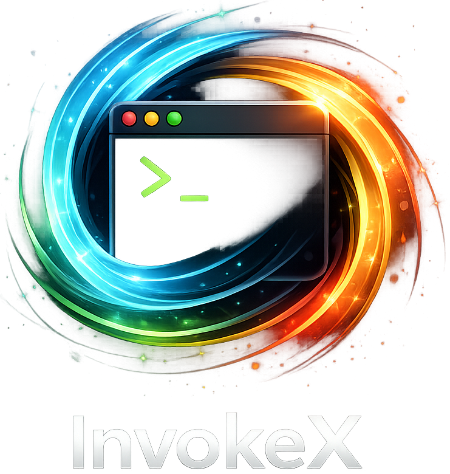
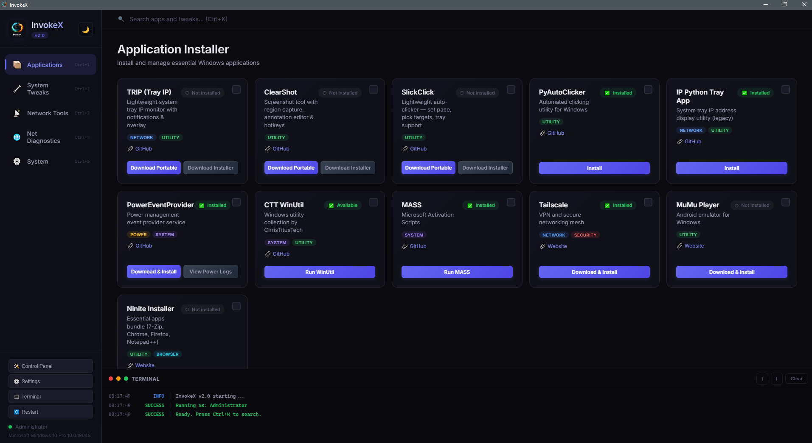
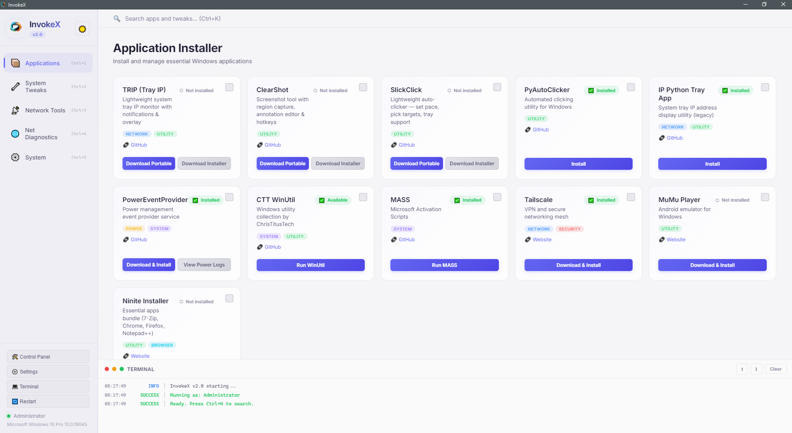
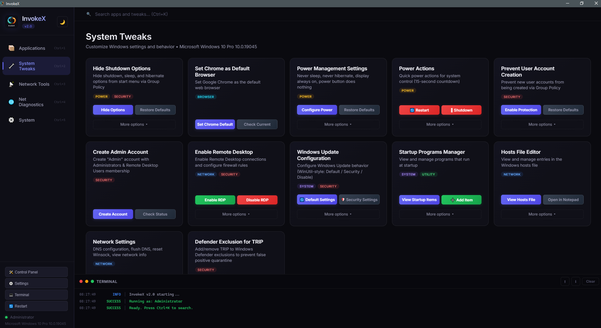
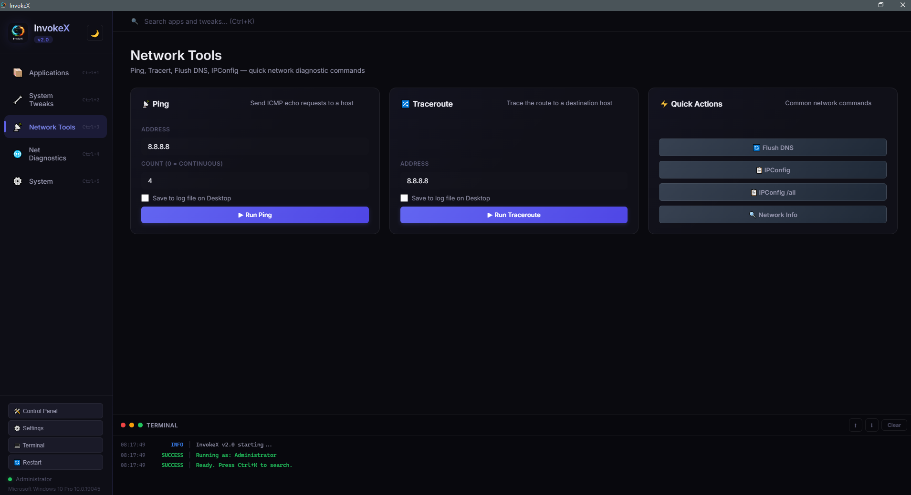
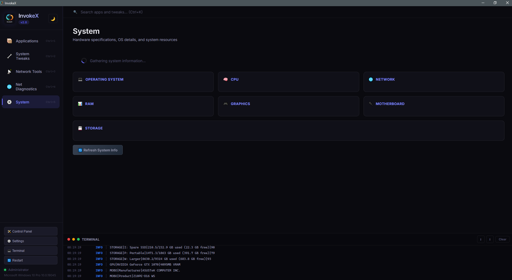
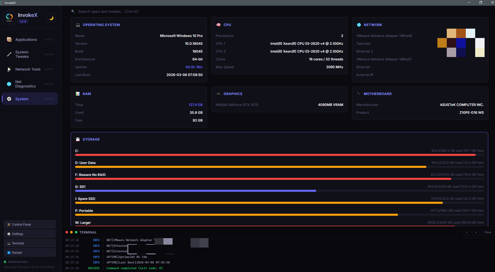

<p align="center">
  
</p>

<h1 align="center">InvokeX</h1>

<p align="center">
  <strong>Modern Windows Toolkit — App Installer, System Tweaks & Network Diagnostics</strong><br>
  Built with Electron · Portable EXE · No Dependencies Required
</p>

<p align="center">
  
  
  
  
</p>

---

## 🚀 Quick Install

```powershell
irm https://raw.githubusercontent.com/GoblinRules/InvokeX/main/install.ps1 | iex
```

Or download the portable EXE directly from [Releases](https://github.com/GoblinRules/InvokeX/releases/latest).

---

## 📸 Screenshots

### Application Installer — Dark & Light Themes

<p align="center">
  
  
</p>

### System Tweaks

<p align="center">
  
</p>

### Network Tools

<p align="center">
  
</p>

### System Information

<p align="center">
  
  
</p>

---

## ✨ Features

### 📦 Application Installer
Install and manage essential Windows applications with one click:
- **TRIP (Tray IP)** — Lightweight system tray IP monitor
- **ClearShot** — Screenshot tool with region capture & annotation
- **SlickClick** — Lightweight auto-clicker
- **PyAutoClicker** — Automated clicking utility
- **IP Python Tray App** — System tray IP display (legacy)
- **PowerEventProvider** — Power management event provider service
- **CTT WinUtil** — ChrisTitusTech's Windows utility collection
- **MASS** — Microsoft Activation Scripts
- **Tailscale** — VPN and secure networking mesh
- **MuMu Player** — Android emulator for Windows
- **Ninite** — Essential apps bundle (7-Zip, Chrome, Firefox, Notepad++)

Each app card shows real-time install status, category tags, and links to source repositories.

### 🔧 System Tweaks
11 powerful system configuration tools:
- Hide Shutdown Options from power menu
- Set Chrome as Default Browser
- Power Management Settings (never sleep, display always on)
- Power Actions with countdown (Restart / Shutdown)
- Prevent User Account Creation via Group Policy
- Create Admin Account with proper group membership
- Enable/Disable Remote Desktop with firewall rules
- Windows Update Configuration (Default / Security / Disable)
- Startup Programs Manager
- Hosts File Editor
- Network Settings (DNS, Flush DNS, Winsock reset)
- Defender Exclusion for TRIP

### 🌐 Network Tools
Built-in network diagnostics suite:
- **Ping** — ICMP echo requests with configurable count
- **Traceroute** — Route tracing to destination hosts
- **Quick Actions** — Flush DNS, IPConfig, IPConfig /all, Network Info

### 💻 System Information
Comprehensive hardware overview:
- OS details, CPU, RAM, GPU, Motherboard
- Storage drives with visual usage bars and free space indicators
- Network adapter listing

### 🎨 Premium UI
- **Dual theme** — Dark (glassmorphism) and Light modes with toggle
- **Integrated terminal** — Real-time color-coded command output
- **Search** — Global search bar (Ctrl+K) across all sections
- **Keyboard shortcuts** — Navigate sections with Ctrl+1 through Ctrl+5
- **Admin detection** — Status indicator and one-click elevation
- **Batch operations** — Select and install multiple apps at once
- **Toast notifications** — Non-intrusive success/error feedback

---

## 📋 Requirements

- **Windows 10 or 11**
- **Internet connection** (for downloads)
- **Administrator privileges** (recommended — some tweaks require elevation)

No Python, Node.js, or other runtime needed — InvokeX is a self-contained portable EXE.

---

## 🚀 Installation

### Method 1: PowerShell One-Liner (Recommended)
```powershell
irm https://raw.githubusercontent.com/GoblinRules/InvokeX/main/install.ps1 | iex
```

This will:
- ✅ Download `InvokeX.exe` (~75 MB) to `C:\Tools\InvokeX`
- ✅ Create Desktop shortcut with custom icon
- ✅ Create Start Menu shortcut
- ✅ Optionally launch the app immediately

### Method 2: Direct Download
1. Go to [Releases](https://github.com/GoblinRules/InvokeX/releases/latest)
2. Download `InvokeX.exe`
3. Run it from anywhere — it's fully portable

---

## 🎮 Usage

| Action | How |
|---|---|
| **Launch** | Double-click `InvokeX.exe` or the Desktop shortcut |
| **Switch sections** | Click sidebar or press `Ctrl+1` through `Ctrl+5` |
| **Search** | `Ctrl+K` to focus the search bar |
| **Toggle theme** | Click the ☀️/🌙 icon in the header |
| **Restart as Admin** | Click banner or use the Restart button in sidebar |
| **Batch install** | Check app cards → batch actions appear |

### Terminal Output Colors
| Color | Meaning |
|---|---|
| 🟢 Green | Success |
| 🔵 Blue | Information |
| 🟡 Yellow | Warning |
| 🔴 Red | Error |

---

## 📁 Project Structure

```
InvokeX/
├── main.js              # Electron main process (IPC, downloads, system ops)
├── preload.js           # Context bridge (secure IPC exposure)
├── index.html           # Application shell
├── styles.css           # Full design system (dark/light themes)
├── renderer.js          # UI logic, app cards, tweaks, diagnostics
├── install.ps1          # PowerShell installer script
├── package.json         # Electron + builder configuration
├── assets/
│   ├── icon1.ico        # Application icon
│   ├── icon1.png        # Application icon (PNG)
│   ├── screenshots/     # README screenshots
│   └── scripts/         # Bundled PowerShell scripts (NetTriage, etc.)
└── logs/                # Session logs (created at runtime)
```

---

## 🗑️ Uninstallation

1. Delete `C:\Tools\InvokeX`
2. Remove Desktop shortcut (`InvokeX.lnk`)
3. Remove Start Menu folder: `%APPDATA%\Microsoft\Windows\Start Menu\Programs\InvokeX`

---

## 🛠️ Development

```bash
# Clone and install dependencies
git clone https://github.com/GoblinRules/InvokeX.git
cd InvokeX
npm install

# Run in development mode
npm run dev

# Build portable EXE + NSIS installer
npm run dist
```

---

## 📄 License

MIT License — see [LICENSE](LICENSE) for details.

---

<p align="center">
  <strong>Made with ❤️ by <a href="https://github.com/GoblinRules">GoblinRules</a></strong>
</p>
